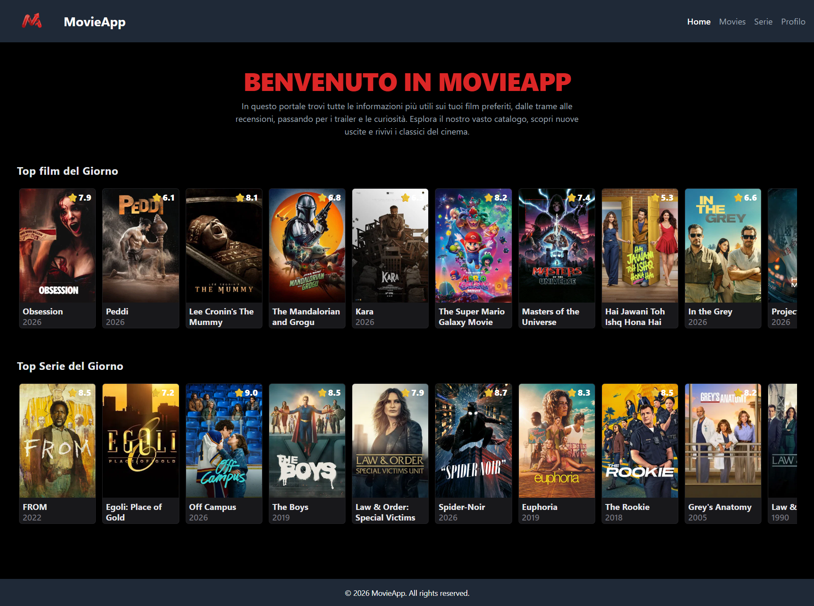
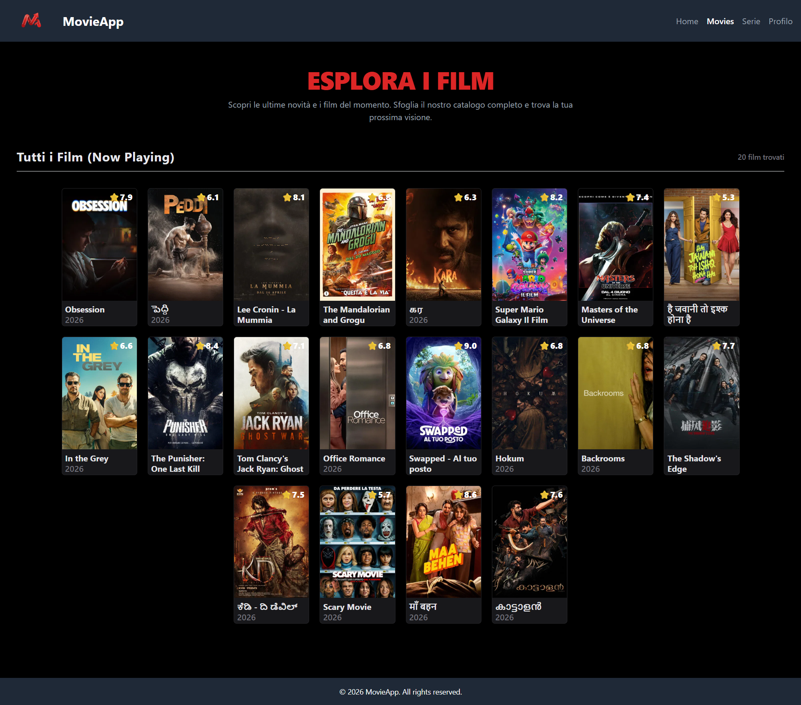
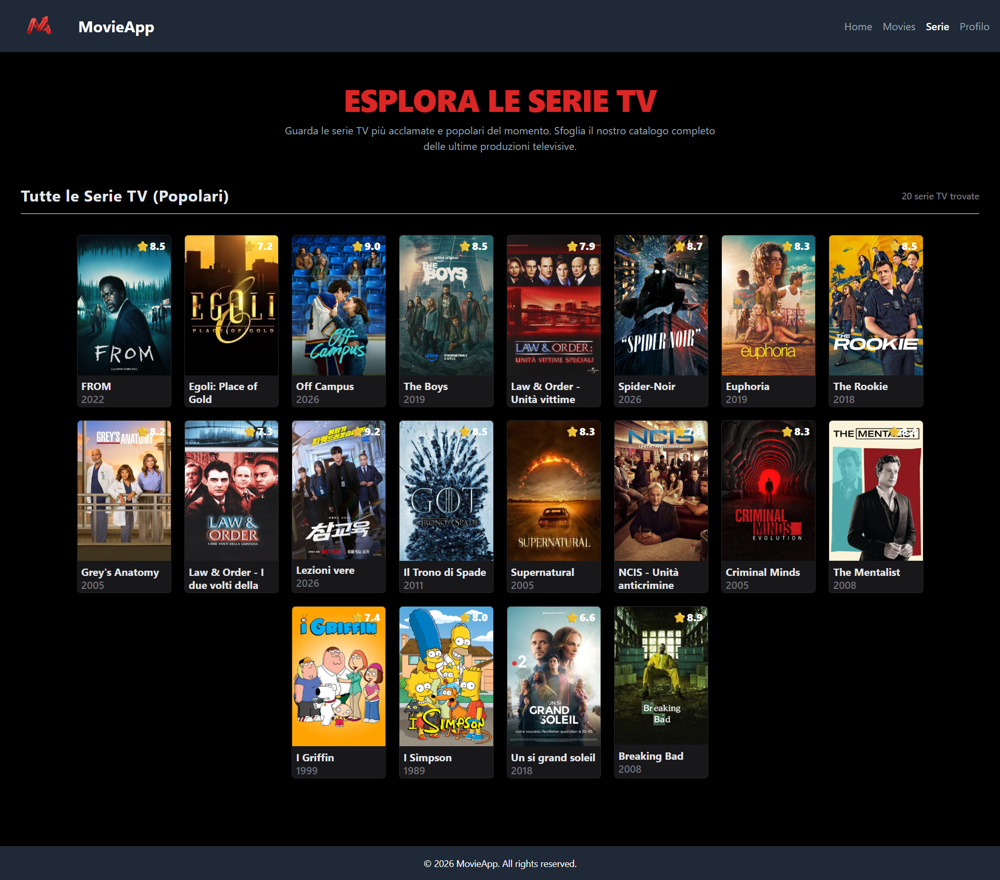
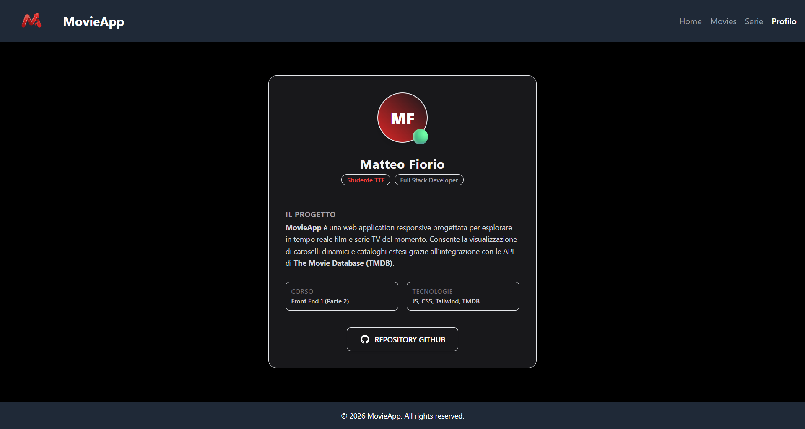

# MovieApp

**Autore:** Matteo Fiorio  
**Corso:** Front End 1 (Parte 2)

MovieApp è una web application responsive progettata per esplorare in tempo reale film e serie TV del momento. Consente la visualizzazione di caroselli dinamici, cataloghi estesi a griglia e pagine di dettaglio interattive grazie all'integrazione con le API ufficiali di **The Movie Database (TMDB)**.

## Repo Esame

[Prof Reverberi Repo](https://github.com/lukeku62/esame-frontend)


## Tecnologie Utilizzate

- **HTML5**: Per la struttura semantica e l'accessibilità del portale.
- **CSS3 (Vanilla)**: Per le animazioni di transizione, la gestione avanzata dei layout (effetti di sfumatura e sovrapposizione backdrop) e la compatibilità cross-browser delle card.
- **Tailwind CSS (v2.2.19)**: Framework CSS per la prototipazione rapida del design.
- **JavaScript (ES6+)**: Utilizzo dei moduli nativi (`type="module"`) e di `async/await` per la gestione asincrona delle chiamate API.
- **Vite**: Server di sviluppo locale e bundler veloce per l'ottimizzazione del progetto.
- **TMDB API**: Servizio esterno per il recupero in tempo reale di metadati, poster, immagini e trame dei film e delle serie.

---

## Come Eseguire il Progetto in Locale

Ci sono due modi semplici per avviare il sito localmente:

### Metodo 1: Tramite Vite (Consigliato)
Assicurati di avere [Node.js](https://nodejs.org/) installato sulla tua macchina.
1. Apri il terminale nella cartella del progetto.
2. Esegui il comando di sviluppo integrato:
   ```bash
   npx vite
   ```
3. Fai CTRL + Click sul link visualizzato nel terminale (es. `http://localhost:5173/` o `http://localhost:5174/`) per aprire il sito nel browser.

### Metodo 2: Tramite Live Server (VS Code Extension)
1. Apri la cartella del progetto in **Visual Studio Code**.
2. Installa l'estensione **Live Server** dal Marketplace.
3. Fai clic destro sul file `index.html` e seleziona **Open with Live Server** (o fai clic sul pulsante **Go Live** in basso a destra nella finestra di VS Code).

---

## Configurazione delle API Key di TMDB

Per far funzionare le chiamate API e popolare i film e le serie TV, è necessario configurare la chiave di lettura di TMDB:

1. Crea un file chiamato `config.js` all'interno della cartella `js/` del progetto:
   ```
   movieapp-fiorio/
   └── js/
       ├── config.js  <-- Crea questo file
       ├── main.js
       ├── movies.js
       ├── series.js
       └── detail.js
   ```
2. Inserisci all'interno del file `js/config.js` la seguente struttura, sostituendo il valore con il tuo **Token di Accesso in Lettura API (v4 auth)** personale ottenuto da TMDB:
   ```javascript
   export default {
       TMDB_TOKEN: "INSERISCI_QUI_IL_TUO_BEARER_TOKEN_TMDB"
   }
   ```

*(Nota: Per ottenere un token gratuito, registrati su [The Movie Database (TMDB)](https://www.themoviedb.org/), vai nelle impostazioni del tuo account alla sezione **API** e richiedi una chiave sviluppatore).*

---

## Endpoint API TMDB Utilizzati

Il progetto esegue chiamate dinamiche a seconda della pagina visitata:

### 1. Home Page (`index.html` + `js/main.js`)
* **Film del Giorno (Carosello)**:
  * **Endpoint:** `GET /movie/popular`
  * **URL Completo:** `https://api.themoviedb.org/3/movie/popular?language=en-US&page=1`
* **Serie del Giorno (Carosello)**:
  * **Endpoint:** `GET /tv/popular`
  * **URL Completo:** `https://api.themoviedb.org/3/tv/popular?language=en-US&page=1`

### 2. Pagina Film (`movies.html` + `js/movies.js`)
* **Film in Programmazione (Catalogo)**:
  * **Endpoint:** `GET /movie/now_playing`
  * **URL Completo:** `https://api.themoviedb.org/3/movie/now_playing?language=it-IT&page=1`

### 3. Pagina Serie TV (`series.html` + `js/series.js`)
* **Serie TV Popolari (Catalogo)**:
  * **Endpoint:** `GET /tv/popular`
  * **URL Completo:** `https://api.themoviedb.org/3/tv/popular?language=it-IT&page=1`

### 4. Pagina Dettaglio (`detail.html` + `js/detail.js`)
* **Dettagli Film**:
  * **Endpoint:** `GET /movie/{id}`
  * **URL Completo:** `https://api.themoviedb.org/3/movie/{id}?language=it-IT`
* **Dettagli Serie TV**:
  * **Endpoint:** `GET /tv/{id}`
  * **URL Completo:** `https://api.themoviedb.org/3/tv/{id}?language=it-IT`

--

## Preview Web Site

## Foto - 01-index.html
<div align="center">

</div>

## Foto - 02-movies.html
<div align="center">

</div>

## Foto - 03-series.html
<div align="center">

</div>

## Foto - 04-profile.html
<div align="center">

</div>